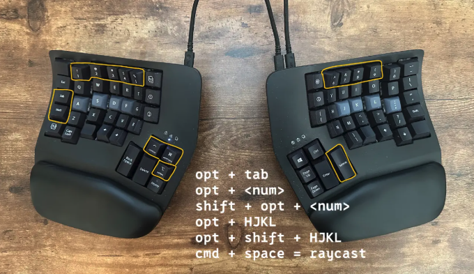

<div align="center">

# 🛠️ Dotfiles


_Velocity • Discoverability • Intelligence • Extensibility_


**My macOS development environment — crafted for speed and aesthetics.**

</div>

---

## 🏛️ Stack Overview

| Category              | Tools                                                                                                                     |
| :-------------------- | :------------------------------------------------------------------------------------------------------------------------ |
| **Shell**             | [Zsh](https://www.zsh.org/) + [Oh My Zsh](https://ohmyz.sh/) + [Powerlevel10k](https://github.com/romkatv/powerlevel10k)  |
| **Terminal**          | [Kitty](https://sw.kovidgoyal.net/kitty/) • [Warp](https://www.warp.dev/)                                                 |
| **Editor**            | [Neovim](https://neovim.io/) ([LazyVim](https://www.lazyvim.org/)) • [VSCode](https://code.visualstudio.com/)             |
| **Window Management** | [AeroSpace](https://github.com/nikitabobko/AeroSpace) • [JankyBorders](https://github.com/FelixKratz/JankyBorders)        |
| **Menu Bar**          | [SketchyBar](https://github.com/FelixKratz/SketchyBar)                                                                    |
| **Prompt**            | [Starship](https://starship.rs/)                                                                                          |
| **Git**               | [Git](https://git-scm.com/) + [GitHub CLI](https://cli.github.com/) + [LazyGit](https://github.com/jesseduffield/lazygit) |
| **Prompt**            | [Starship](https://starship.rs/)                                                                                          |
| **Note System**       | [Obsidian](https://obsidian.md/)                                                                                          |

---

## 🚀 Installation

```bash
# Clone the repo
git clone https://github.com/YOUR_USERNAME/dotfiles.git ~/.config/dotfiles

# Run the install script
cd ~/.config/dotfiles
./install.sh
```

<details>
<summary>📦 What the script does</summary>

1. Install [Homebrew](https://brew.sh/) (if needed)
2. Install all packages from the Brewfile
3. Symlink all configs to the correct locations
4. Install Oh My Zsh and Powerlevel10k

</details>

<details>
<summary>🔧 VSCode Setup</summary>

```bash
# Copy settings
cp ~/.config/dotfiles/vscode/settings.json ~/Library/Application\ Support/Code/User/
cp ~/.config/dotfiles/vscode/keybindings.json ~/Library/Application\ Support/Code/User/

# Install extensions
cat ~/.config/dotfiles/vscode/extensions.txt | xargs -L 1 code --install-extension
```

</details>

<details>
<summary>✅ Manual Steps After Install</summary>

1. Restart your terminal
2. Start services:
   ```bash
   brew services start sketchybar
   brew services start borders
   ```
3. Open AeroSpace to enable tiling
4. Configure any app-specific settings

</details>

<details>
<summary>🔄 Updating Brewfile</summary>

```bash
brew bundle dump --file=~/.config/dotfiles/Brewfile --force
```

</details>

---

## 🖥️ Third-Party Apps

### 🔧 Productivity & Utilities

[](https://clipy-app.com/)
[](https://sindresorhus.com/dato)
[](https://apps.apple.com/app/devcleaner-for-xcode/id1388020431)
[](https://flowapp.info/)
[](https://justgetflux.com/)
[](https://www.keyboardmaestro.com/)
[](https://apps.apple.com/app/keystroke-pro/id1572206224)
[](https://magnet.crowdcafe.com/)
[](https://apps.apple.com/app/mirror-magnet/id1563698880)
[](https://www.raycast.com/)
[](https://apps.apple.com/app/theine/id955848755)

### 💻 Development

[](https://www.usebruno.com/)
[](https://cursor.sh/)
[](https://www.docker.com/)
[](https://sw.kovidgoyal.net/kitty/)
[](https://popsql.com/)
[](https://www.postman.com/)
[](https://code.visualstudio.com/)
[](https://www.warp.dev/)
[](https://developer.apple.com/xcode/)

### 🎨 Design & Creative

[](https://affinity.serif.com/)
[](https://www.blender.org/)
[](https://www.figma.com/)
[](https://obsproject.com/)

### 📝 Writing & Notes

[](https://www.notion.so/)
[](https://obsidian.md/)
[](https://www.literatureandlatte.com/scapple/overview)
[](https://www.literatureandlatte.com/scrivener/overview)
[](https://typora.io/)

### 🌎 Browsers

[](https://www.mozilla.org/firefox/)
[](https://www.mozilla.org/firefox/developer/)
[](https://www.google.com/chrome/)
[](https://www.microsoft.com/edge)
[](https://zen-browser.app/)

### 💬 AI, Communication & Corp

[](https://claude.ai/)
[](https://www.microsoft.com/microsoft-365/outlook)
[](https://www.microsoft.com/microsoft-teams)
[](https://slack.com/)
[](https://zoom.us/)

[](https://www.microsoft.com/microsoft-365/excel)
[](https://www.microsoft.com/microsoft-365/onenote)
[](https://www.microsoft.com/microsoft-365/powerpoint)
[](https://www.microsoft.com/microsoft-365/word)
[](https://www.microsoft.com/microsoft-365/onedrive)

### 🔒 Security & Privacy

[](https://proton.me/drive)
[](https://proton.me/mail)
[](https://protonvpn.com/)

---

## 🤓 CLI Tools

[](https://aws.amazon.com/cli/)
[](https://www.gnu.org/software/bash/)
[](https://github.com/sharkdp/bat)
[](https://github.com/sharkdp/fd)
[](https://fishshell.com/)
[](https://github.com/junegunn/fzf)
[](https://cli.github.com/)
[](https://git-scm.com/)
[](https://go.dev/)
[](https://github.com/jesseduffield/lazygit)
[](https://github.com/lsd-rs/lsd)
[](https://github.com/dylanaraps/neofetch)
[](https://neovim.io/)
[](https://github.com/nvm-sh/nvm)
[](https://github.com/BurntSushi/ripgrep)
[](https://starship.rs/)
[](https://www.terraform.io/)
[](https://github.com/tmux/tmux)
[](https://linux.die.net/man/1/tree)
[](https://yazi-rs.github.io/)
[](https://github.com/adrienverge/yamllint)
[](https://zellij.dev/)
[](https://github.com/ajeetdsouza/zoxide)
[](https://www.zsh.org/)

---

## ⌨️ Hardware & Other

[](https://kinesis-ergo.com/keyboards/advantage360/)
[](https://bambulab.com/)
[](https://www.raspberrypi.com/software/)
[](https://www.shure.com/en-US/microphones/mv7)
[](https://www.spotify.com/)

---

<div align="center">



_Built with ☕_

</div>
