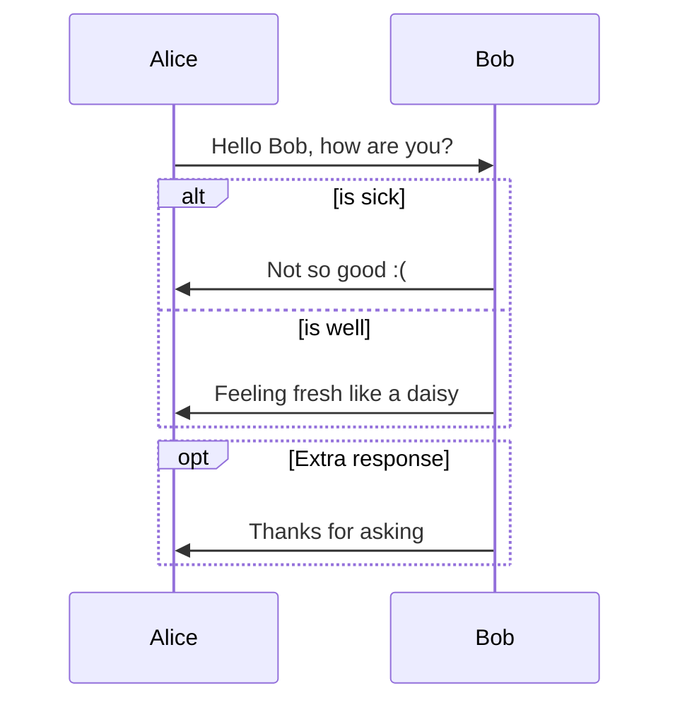

# Markdown Guide - an H1

## This is an H2

###### This is an H6


> this is a blockquote
>
> >
> >
> >this is second paragraph


> This is another blockquote with one paragraph. There are three empty lines to separate two blockquotes.


## un-ordered list

*   Red
*   Green
*   Blue

## ordered list

1. Red
2. Green
3. Blue

this one is \- [ ] or \- [x] 

- [ ] a task list item
- [x] completed task item


## Fenced Code Blocks

```js
function test() {
	console.log('Ya buddy!')
}
```

```go
func main() {
  fmt.Println("Light weight!")
}
```

## Table

| First Header | Second Header | completed? | Anthing |
| ------------ | ------------- | ---------- | ------- |
| test         | test`         | test       | test    |
|              |               |            |         |
|              |               |            |         |


| Left-Aligned  | Center Aligned  | Right Aligned |
| :------------ | :-------------: | ------------: |
| col 3 is      | some wordy text |         $1600 |
| col 2 is      |    centered     |           $12 |
| zebra stripes |    are neat     |            $1 |


## Footnotes

You can create footnotes like this[^a] and this[^b].

[^a]: Here is the *text* of the first **footnote**.
[^b]: Here is the *text* of the second **footnote**.

### Horizontal Rules

Entering `***` or `---` on a blank line and pressing Return will draw a horizontal line.

***

---

## Span Elements

###### Inline Links

This is [an example](http://frankcarv.com/ "Title") inline link.

[This link](http://frankcarv.com/) has no title attribute.

###### Reference Links 

This is [an example][id] reference-style link.

Then, anywhere in the document, you define your link label on a line by itself like this:

[id]: http://example.com/  "Optional Title Here"


Styled one:

[Google][]
And then define the link:

[Google]: http://google.com/


###### Image urls


###### Emphasis

*single asterisks*

_single underscores_

\*this text is surrounded by literal asterisks\*


###### Strong

**double asterisks**

__double underscores__


###### Code

Use the `printf()` function.


###### Strikethrough

~~Mistaken text.~~ becomes Mistaken text.


###### Emoji

Emoji :happy:


~H~2~0, X~long\ text~/

# Sequence Diagram Options

https://support.typora.io/Draw-Diagrams-With-Markdown/#sequence-diagrams

https://bramp.github.io/js-sequence-diagrams/#syntax

Can change by adding custom CSS: https://support.typora.io/Add-Custom-CSS/

```sequence
Frank->Bill: Hello Bill, how were the tacos?
Note right of Bill: Bill thinks
Bill->Frank: Those tacos were dam good!

```


# Flowcharts

```flow
st=>start: Start
op=>operation: Your Operation
cond=>condition: Yes or No?
e=>end

st->op->cond
cond(yes)->e
cond(no)->op
```

# Mermaid Diagrams

https://support.typora.io/Draw-Diagrams-With-Markdown/#mermaid-options

https://mermaid.js.org/syntax/sequenceDiagram.html


